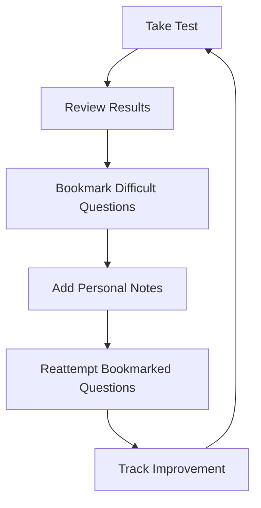

# 🧠 Prepnosis

<div align="center">
  
  
  <h3>🎯 The Ultimate NEET-PG & INICET Preparation Platform</h3>
  
  <p>An open-source, fully interactive web platform designed for medical aspirants to practice high-yield MCQs, track progress, and compete with peers in a realistic exam environment.</p>

  <!-- Badges -->
  <p>
    
    
    
    
    
  </p>

  <p>
    <a href="#features">Features</a> •
    <a href="#quick-start">Quick Start</a> •
    <a href="#tech-stack">Tech Stack</a> •
    <a href="#screenshots">Screenshots</a> •
    <a href="#contributing">Contributing</a>
  </p>
</div>

---

## 🌟 Why Prepnosis?

> **"Success in NEET-PG isn't just about knowing the answers—it's about practicing under pressure, analyzing your weaknesses, and continuously improving."**

Prepnosis transforms the traditional approach to medical exam preparation by providing:

- 🎯 **Realistic Exam Environment** - Timed tests that mirror actual NEET-PG/INICET conditions
- 📊 **Advanced Analytics** - Deep insights into your performance patterns
- 🏆 **Competitive Learning** - Leaderboards and peer comparison
- 🧠 **Smart Retention** - Bookmarks, notes, and spaced repetition
- 📱 **Responsive Design** - Practice anywhere, anytime

---

## ✨ Features

### 📝 **Comprehensive Test Types**

| Test Type | Description | Key Benefits |
|-----------|-------------|--------------|
| **🌍 Public Grand Tests** | Full-syllabus, time-bound tests open to all users | Live leaderboards, realistic exam pressure |
| **📚 Subject Tests** | Focused practice on individual subjects | Targeted improvement, subject mastery |
| **🎨 Custom Tests** | User-created tests by topic/difficulty | Personalized practice, flexible learning |
| **⚡ Daily Challenges** | Optional timed mini-challenges | Consistent practice habit |

### 📊 **Advanced Analytics & Insights**

<details>
<summary>🔍 Click to explore analytics features</summary>

- **Performance Dashboard**: Visual analytics per subject, topic, and test type
- **Rank & Percentile Tracking**: See your position with movement trends
- **Subject-wise Strength Analysis**: Identify your strong and weak areas
- **Topic-wise Heatmaps**: Visual representation of your performance across topics
- **Time Analysis**: Track your speed and accuracy patterns
- **Progress Trends**: Monitor improvement over time

</details>

### 🧠 **Smart Retention Tools**



### 🎮 **Engagement Features**

- **🏆 Leaderboards**: Public ranking for grand tests and cumulative performance
- **⚔️ Battle Mode**: Real-time 1v1 quiz battles with friends or random users
- **🎯 Achievement System**: Unlock badges and milestones
- **📱 Social Features**: Share progress and compete with study groups

---

## 🚀 Quick Start

### Prerequisites

- Node.js 18+ 
- npm or yarn
- Supabase account

### Installation

1. **Clone the repository**
   ```bash
   git clone https://github.com/yourusername/prepnosis.git
   cd prepnosis
   ```

2. **Install dependencies**
   ```bash
   npm install
   # or
   yarn install
   ```

3. **Set up environment variables**
   ```bash
   cp .env.example .env.local
   ```
   
   Fill in your Supabase credentials:
   ```env
   NEXT_PUBLIC_SUPABASE_URL=your_supabase_url
   NEXT_PUBLIC_SUPABASE_ANON_KEY=your_supabase_anon_key
   ```

4. **Run the development server**
   ```bash
   npm run dev
   # or
   yarn dev
   ```

5. **Open your browser**
   Navigate to `http://localhost:3000` 🎉

---

## 🛠️ Tech Stack

<div align="center">

| Category | Technology | Purpose |
|----------|------------|---------|
| **Frontend** |  | App Router, SSR, Performance |
| **Database** |  | Database, Auth, Realtime |
| **UI Components** |  | Beautiful, accessible components |
| **Styling** |  | Utility-first CSS framework |
| **State Management** |  | Lightweight state management |
| **Data Fetching** |  | Server state management |
| **Animations** |  | Smooth animations |

</div>

---

## 📋 Question Format

Questions in Prepnosis follow a standardized schema for consistency:

```json
{
  "id": "uuid",
  "question": "Gp2b3A inhibitors are all except -",
  "opa": "Abciximab",
  "opb": "Eptifibatide", 
  "opc": "Tirofiban",
  "opd": "Prasugrel",
  "exp": "Ans. is 'd' i.e., Prasugrel. Prasugrel is a P2Y12 receptor antagonist, not a Gp2b3A inhibitor...",
  "cop": 4,
  "subject_name": "Pharmacology",
  "topic_name": "Antiplatelets and Fibrinolytics",
  "choice_type": "multi"
}
```

---

## 🎯 Roadmap

### Phase 1: Core Platform ✅
- [x] Basic test interface
- [x] User authentication
- [x] Question management system
- [x] Basic analytics

### Phase 2: Enhanced Features 🚧
- [ ] Advanced analytics dashboard
- [ ] Leaderboard system
- [ ] Bookmark functionality
- [ ] Performance tracking

### Phase 3: Social Features 🔮
- [ ] Battle Mode (1v1 quiz battles)
- [ ] Study groups
- [ ] Discussion forums
- [ ] Mentor system

### Phase 4: AI Integration 🤖
- [ ] Personalized question recommendations
- [ ] Adaptive difficulty
- [ ] Smart scheduling
- [ ] Performance predictions

---

## 📸 Screenshots

<div align="center">
  
  
</div>

---

## 🤝 Contributing

We love contributions! Here's how you can help make Prepnosis even better:

### Ways to Contribute

- 🐛 **Report Bugs**: Found an issue? Let us know!
- 💡 **Suggest Features**: Have ideas? We'd love to hear them!
- 📝 **Improve Documentation**: Help make our docs clearer
- 🔧 **Submit Code**: Fix bugs or add features
- 📊 **Add Questions**: Contribute high-quality MCQs

### Getting Started

1. Fork the repository
2. Create a feature branch (`git checkout -b feature/amazing-feature`)
3. Commit your changes (`git commit -m 'Add amazing feature'`)
4. Push to the branch (`git push origin feature/amazing-feature`)
5. Open a Pull Request

### Development Guidelines

- Follow the existing code style
- Write meaningful commit messages
- Add tests for new features
- Update documentation as needed

---

## 📄 License

This project is licensed under the MIT License - see the [LICENSE](LICENSE) file for details.

---

## 🎉 Acknowledgments

- Medical students and educators who provided feedback
- Open source community for amazing tools and libraries
- Contributors who help make this platform better every day

---

<div align="center">
  <h3>📞 Get In Touch</h3>
  
  <p>
    <a href="https://github.com/yourusername/prepnosis/issues">🐛 Report Issues</a> •
    <a href="https://github.com/yourusername/prepnosis/discussions">💬 Discussions</a> •
    <a href="mailto:contact@prepnosis.com">📧 Contact Us</a>
  </p>

  <p>
    <strong>Built with ❤️ for medical aspirants</strong>
  </p>
  
  <p>
    
  </p>
</div>

---

**⭐ If you find Prepnosis helpful, please consider giving it a star on GitHub! ⭐**
